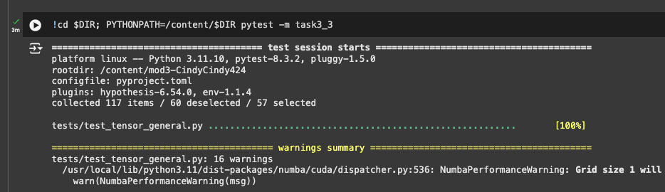
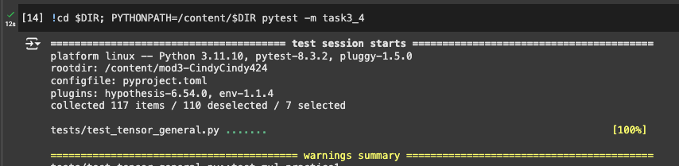

# MiniTorch Module 3


* Docs: https://minitorch.github.io/

* Overview: https://minitorch.github.io/module3.html


You will need to modify `tensor_functions.py` slightly in this assignment.

* Tests:

```
python run_tests.py
```

* Note:

Several of the tests for this assignment will only run if you are on a GPU machine and will not
run on github's test infrastructure. Please follow the instructions to setup up a colab machine
to run these tests.

This assignment requires the following files from the previous assignments. You can get these by running

```bash
python sync_previous_module.py previous-module-dir current-module-dir
```

The files that will be synced are:

        minitorch/tensor_data.py minitorch/tensor_functions.py minitorch/tensor_ops.py minitorch/operators.py minitorch/scalar.py minitorch/scalar_functions.py minitorch/module.py minitorch/autodiff.py minitorch/module.py project/run_manual.py project/run_scalar.py project/run_tensor.py minitorch/operators.py minitorch/module.py minitorch/autodiff.py minitorch/tensor.py minitorch/datasets.py minitorch/testing.py minitorch/optim.py


# Results

## Task 3-1 and 3-2 Diagnostics Output

```
MAP
OMP: Info #276: omp_set_nested routine deprecated, please use omp_set_max_active_levels instead.
 
================================================================================
 Parallel Accelerator Optimizing:  Function tensor_map.<locals>._map, 
/Users/cindy/Documents/GitHub/mod3-CindyCindy424/minitorch/fast_ops.py (163)  
================================================================================


Parallel loop listing for  Function tensor_map.<locals>._map, /Users/cindy/Documents/GitHub/mod3-CindyCindy424/minitorch/fast_ops.py (163) 
-----------------------------------------------------------------------------|loop #ID
    def _map(                                                                | 
        out: Storage,                                                        | 
        out_shape: Shape,                                                    | 
        out_strides: Strides,                                                | 
        in_storage: Storage,                                                 | 
        in_shape: Shape,                                                     | 
        in_strides: Strides,                                                 | 
    ) -> None:                                                               | 
        # TODO: Implement for Task 3.1.                                      | 
        # raise NotImplementedError("Need to implement for Task 3.1")        | 
        if (                                                                 | 
            len(out_strides) != len(in_strides)                              | 
            or (out_strides != in_strides).any()-----------------------------| #0
            or (out_shape != in_shape).any()---------------------------------| #1
        ):                                                                   | 
            for i in prange(len(out)):---------------------------------------| #3
                out_index: Index = np.empty(MAX_DIMS, np.int32)              | 
                in_index: Index = np.empty(MAX_DIMS, np.int32)               | 
                to_index(i, out_shape, out_index)                            | 
                broadcast_index(out_index, out_shape, in_shape, in_index)    | 
                o = index_to_position(out_index, out_strides)                | 
                j = index_to_position(in_index, in_strides)                  | 
                out[o] = fn(in_storage[j])                                   | 
        else:                                                                | 
            for i in prange(len(out)):---------------------------------------| #2
                out[i] = fn(in_storage[i])                                   | 
--------------------------------- Fusing loops ---------------------------------
Attempting fusion of parallel loops (combines loops with similar properties)...
Following the attempted fusion of parallel for-loops there are 4 parallel for-
loop(s) (originating from loops labelled: #0, #1, #3, #2).
--------------------------------------------------------------------------------
----------------------------- Before Optimisation ------------------------------
--------------------------------------------------------------------------------
------------------------------ After Optimisation ------------------------------
Parallel structure is already optimal.
--------------------------------------------------------------------------------
--------------------------------------------------------------------------------
 
---------------------------Loop invariant code motion---------------------------
Allocation hoisting:
The memory allocation derived from the instruction at 
/Users/cindy/Documents/GitHub/mod3-CindyCindy424/minitorch/fast_ops.py (179) is 
hoisted out of the parallel loop labelled #3 (it will be performed before the 
loop is executed and reused inside the loop):
   Allocation:: out_index: Index = np.empty(MAX_DIMS, np.int32)
    - numpy.empty() is used for the allocation.
The memory allocation derived from the instruction at 
/Users/cindy/Documents/GitHub/mod3-CindyCindy424/minitorch/fast_ops.py (180) is 
hoisted out of the parallel loop labelled #3 (it will be performed before the 
loop is executed and reused inside the loop):
   Allocation:: in_index: Index = np.empty(MAX_DIMS, np.int32)
    - numpy.empty() is used for the allocation.
None
ZIP
 
================================================================================
 Parallel Accelerator Optimizing:  Function tensor_zip.<locals>._zip, 
/Users/cindy/Documents/GitHub/mod3-CindyCindy424/minitorch/fast_ops.py (217)  
================================================================================


Parallel loop listing for  Function tensor_zip.<locals>._zip, /Users/cindy/Documents/GitHub/mod3-CindyCindy424/minitorch/fast_ops.py (217) 
---------------------------------------------------------------------------------------------------|loop #ID
    def _zip(                                                                                      | 
        out: Storage,                                                                              | 
        out_shape: Shape,                                                                          | 
        out_strides: Strides,                                                                      | 
        a_storage: Storage,                                                                        | 
        a_shape: Shape,                                                                            | 
        a_strides: Strides,                                                                        | 
        b_storage: Storage,                                                                        | 
        b_shape: Shape,                                                                            | 
        b_strides: Strides,                                                                        | 
    ) -> None:                                                                                     | 
        # TODO: Implement for Task 3.1.                                                            | 
        # raise NotImplementedError("Need to implement for Task 3.1")                              | 
        if (                                                                                       | 
            len(out_strides) != len(a_strides)                                                     | 
            or len(out_strides) != len(b_strides)                                                  | 
            or (out_strides != a_strides).any()----------------------------------------------------| #4
            or (out_strides != b_strides).any()----------------------------------------------------| #5
            or (out_shape != a_shape).any()--------------------------------------------------------| #6
            or (out_shape != b_shape).any() -------------------------------------------------------| #7
        ):                                                                                         | 
            for i in prange(len(out)):-------------------------------------------------------------| #9
                out_index: Index = np.empty(MAX_DIMS, np.int32)                                    | 
                a_index: Index = np.empty(MAX_DIMS, np.int32)                                      | 
                b_index: Index = np.empty(MAX_DIMS, np.int32)                                      | 
                to_index(i, out_shape, out_index)                                                  | 
                o = index_to_position(out_index, out_strides)                                      | 
                broadcast_index(out_index, out_shape, a_shape, a_index)                            | 
                j = index_to_position(a_index, a_strides)                                          | 
                # broadcast_index(out_index, out_shape, b_shape, a_index)                          | 
                broadcast_index(out_index, out_shape, b_shape, b_index)  # Fixed to use b_index    | 
                k = index_to_position(b_index, b_strides)                                          | 
                out[o] = fn(a_storage[j], b_storage[k])                                            | 
        else:                                                                                      | 
            for i in prange(len(out)):-------------------------------------------------------------| #8
                out[i] = fn(a_storage[i], b_storage[i])                                            | 
--------------------------------- Fusing loops ---------------------------------
Attempting fusion of parallel loops (combines loops with similar properties)...
Following the attempted fusion of parallel for-loops there are 6 parallel for-
loop(s) (originating from loops labelled: #4, #5, #6, #7, #9, #8).
--------------------------------------------------------------------------------
----------------------------- Before Optimisation ------------------------------
--------------------------------------------------------------------------------
------------------------------ After Optimisation ------------------------------
Parallel structure is already optimal.
--------------------------------------------------------------------------------
--------------------------------------------------------------------------------
 
---------------------------Loop invariant code motion---------------------------
Allocation hoisting:
The memory allocation derived from the instruction at 
/Users/cindy/Documents/GitHub/mod3-CindyCindy424/minitorch/fast_ops.py (239) is 
hoisted out of the parallel loop labelled #9 (it will be performed before the 
loop is executed and reused inside the loop):
   Allocation:: out_index: Index = np.empty(MAX_DIMS, np.int32)
    - numpy.empty() is used for the allocation.
The memory allocation derived from the instruction at 
/Users/cindy/Documents/GitHub/mod3-CindyCindy424/minitorch/fast_ops.py (240) is 
hoisted out of the parallel loop labelled #9 (it will be performed before the 
loop is executed and reused inside the loop):
   Allocation:: a_index: Index = np.empty(MAX_DIMS, np.int32)
    - numpy.empty() is used for the allocation.
The memory allocation derived from the instruction at 
/Users/cindy/Documents/GitHub/mod3-CindyCindy424/minitorch/fast_ops.py (241) is 
hoisted out of the parallel loop labelled #9 (it will be performed before the 
loop is executed and reused inside the loop):
   Allocation:: b_index: Index = np.empty(MAX_DIMS, np.int32)
    - numpy.empty() is used for the allocation.
None
REDUCE
 
================================================================================
 Parallel Accelerator Optimizing:  Function tensor_reduce.<locals>._reduce, 
/Users/cindy/Documents/GitHub/mod3-CindyCindy424/minitorch/fast_ops.py (279)  
================================================================================


Parallel loop listing for  Function tensor_reduce.<locals>._reduce, /Users/cindy/Documents/GitHub/mod3-CindyCindy424/minitorch/fast_ops.py (279) 
-------------------------------------------------------------------------|loop #ID
    def _reduce(                                                         | 
        out: Storage,                                                    | 
        out_shape: Shape,                                                | 
        out_strides: Strides,                                            | 
        a_storage: Storage,                                              | 
        a_shape: Shape,                                                  | 
        a_strides: Strides,                                              | 
        reduce_dim: int,                                                 | 
    ) -> None:                                                           | 
        # TODO: Implement for Task 3.1.                                  | 
        # raise NotImplementedError("Need to implement for Task 3.1")    | 
        for i in prange(len(out)):---------------------------------------| #10
            out_index: Index = np.empty(MAX_DIMS, np.int32)              | 
            reduce_size = a_shape[reduce_dim]                            | 
            to_index(i, out_shape, out_index)                            | 
            o = index_to_position(out_index, out_strides)                | 
            accum = out[o]                                               | 
            j = index_to_position(out_index, a_strides)                  | 
            step = a_strides[reduce_dim]                                 | 
            for s in range(reduce_size):                                 | 
                accum = fn(accum, a_storage[j])                          | 
                j += step                                                | 
            out[o] = accum                                               | 
--------------------------------- Fusing loops ---------------------------------
Attempting fusion of parallel loops (combines loops with similar properties)...
Following the attempted fusion of parallel for-loops there are 1 parallel for-
loop(s) (originating from loops labelled: #10).
--------------------------------------------------------------------------------
----------------------------- Before Optimisation ------------------------------
--------------------------------------------------------------------------------
------------------------------ After Optimisation ------------------------------
Parallel structure is already optimal.
--------------------------------------------------------------------------------
--------------------------------------------------------------------------------
 
---------------------------Loop invariant code motion---------------------------
Allocation hoisting:
The memory allocation derived from the instruction at 
/Users/cindy/Documents/GitHub/mod3-CindyCindy424/minitorch/fast_ops.py (291) is 
hoisted out of the parallel loop labelled #10 (it will be performed before the 
loop is executed and reused inside the loop):
   Allocation:: out_index: Index = np.empty(MAX_DIMS, np.int32)
    - numpy.empty() is used for the allocation.
None
MATRIX MULTIPLY
 
================================================================================
 Parallel Accelerator Optimizing:  Function _tensor_matrix_multiply, 
/Users/cindy/Documents/GitHub/mod3-CindyCindy424/minitorch/fast_ops.py (306)  
================================================================================


Parallel loop listing for  Function _tensor_matrix_multiply, /Users/cindy/Documents/GitHub/mod3-CindyCindy424/minitorch/fast_ops.py (306) 
---------------------------------------------------------------------------------------|loop #ID
def _tensor_matrix_multiply(                                                           | 
    out: Storage,                                                                      | 
    out_shape: Shape,                                                                  | 
    out_strides: Strides,                                                              | 
    a_storage: Storage,                                                                | 
    a_shape: Shape,                                                                    | 
    a_strides: Strides,                                                                | 
    b_storage: Storage,                                                                | 
    b_shape: Shape,                                                                    | 
    b_strides: Strides,                                                                | 
) -> None:                                                                             | 
    """NUMBA tensor matrix multiply function.                                          | 
                                                                                       | 
    Should work for any tensor shapes that broadcast as long as                        | 
                                                                                       | 
    ```                                                                                | 
    assert a_shape[-1] == b_shape[-2]                                                  | 
    ```                                                                                | 
                                                                                       | 
    Optimizations:                                                                     | 
                                                                                       | 
    * Outer loop in parallel                                                           | 
    * No index buffers or function calls                                               | 
    * Inner loop should have no global writes, 1 multiply.                             | 
                                                                                       | 
                                                                                       | 
    Args:                                                                              | 
    ----                                                                               | 
        out (Storage): storage for `out` tensor                                        | 
        out_shape (Shape): shape for `out` tensor                                      | 
        out_strides (Strides): strides for `out` tensor                                | 
        a_storage (Storage): storage for `a` tensor                                    | 
        a_shape (Shape): shape for `a` tensor                                          | 
        a_strides (Strides): strides for `a` tensor                                    | 
        b_storage (Storage): storage for `b` tensor                                    | 
        b_shape (Shape): shape for `b` tensor                                          | 
        b_strides (Strides): strides for `b` tensor                                    | 
                                                                                       | 
    Returns:                                                                           | 
    -------                                                                            | 
        None : Fills in `out`                                                          | 
                                                                                       | 
    """                                                                                | 
    a_batch_stride = a_strides[0] if a_shape[0] > 1 else 0                             | 
    b_batch_stride = b_strides[0] if b_shape[0] > 1 else 0                             | 
                                                                                       | 
    # TODO: Implement for Task 3.2.                                                    | 
    # raise NotImplementedError("Need to implement for Task 3.2")                      | 
    for i1 in prange(out_shape[0]):----------------------------------------------------| #13
        for i2 in prange(out_shape[1]):------------------------------------------------| #12
            for i3 in prange(out_shape[2]):--------------------------------------------| #11
                a_inner = i1 * a_batch_stride + i2 * a_strides[1]                      | 
                b_inner = i1 * b_batch_stride + i3 * b_strides[2]                      | 
                acc = 0.0                                                              | 
                for _ in range(a_shape[2]):                                            | 
                    acc += a_storage[a_inner] * b_storage[b_inner]                     | 
                    a_inner += a_strides[2]                                            | 
                    b_inner += b_strides[1]                                            | 
                out_position = (                                                       | 
                    i1 * out_strides[0] + i2 * out_strides[1] + i3 * out_strides[2]    | 
                )                                                                      | 
                out[out_position] = acc                                                | 
--------------------------------- Fusing loops ---------------------------------
Attempting fusion of parallel loops (combines loops with similar properties)...
Following the attempted fusion of parallel for-loops there are 2 parallel for-
loop(s) (originating from loops labelled: #13, #12).
--------------------------------------------------------------------------------
---------------------------- Optimising loop nests -----------------------------
Attempting loop nest rewrites (optimising for the largest parallel loops)...
 
+--13 is a parallel loop
   +--12 --> rewritten as a serial loop
      +--11 --> rewritten as a serial loop
--------------------------------------------------------------------------------
----------------------------- Before Optimisation ------------------------------
Parallel region 0:
+--13 (parallel)
   +--12 (parallel)
      +--11 (parallel)


--------------------------------------------------------------------------------
------------------------------ After Optimisation ------------------------------
Parallel region 0:
+--13 (parallel)
   +--12 (serial)
      +--11 (serial)


 
Parallel region 0 (loop #13) had 0 loop(s) fused and 2 loop(s) serialized as 
part of the larger parallel loop (#13).
--------------------------------------------------------------------------------
--------------------------------------------------------------------------------
 
---------------------------Loop invariant code motion---------------------------
Allocation hoisting:
No allocation hoisting found
None
```


## Test Result for Task3_3
I ran the tests on the colab GPU environment, and got all tests passed successfully.

(Note: Warnings appeared along the way, but as instructed on Ed, did not spend time fixing the warning since it's not required)



## Test Result for Task3_4
I ran the tests on the colab GPU environment, and got all tests passed successfully.

(Note: Warnings appeared along the way, but as instructed on Ed, did not spend time fixing the warning since it's not required)



## Task 3_5: 
> 3_5 (1): Train a tensor model and add your results for all dataset to the README.


> 3_5 (2): Run a bigger model and record the time per epoch reported by the trainer.
